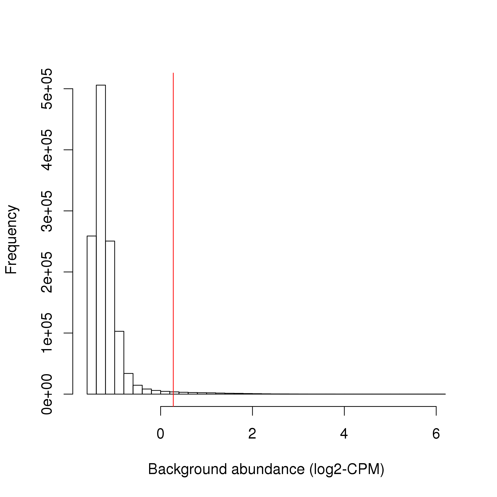
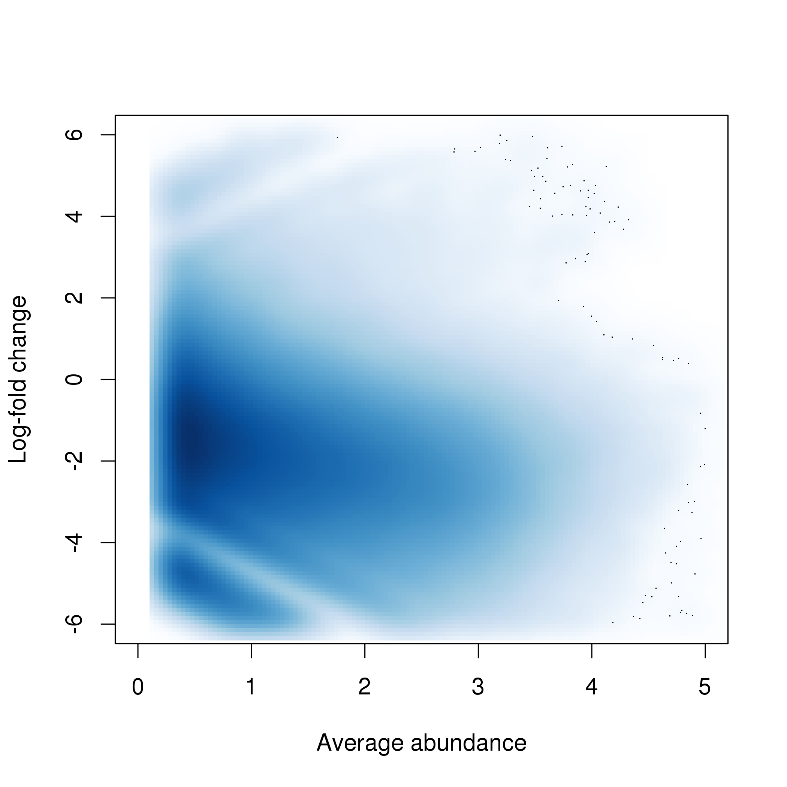
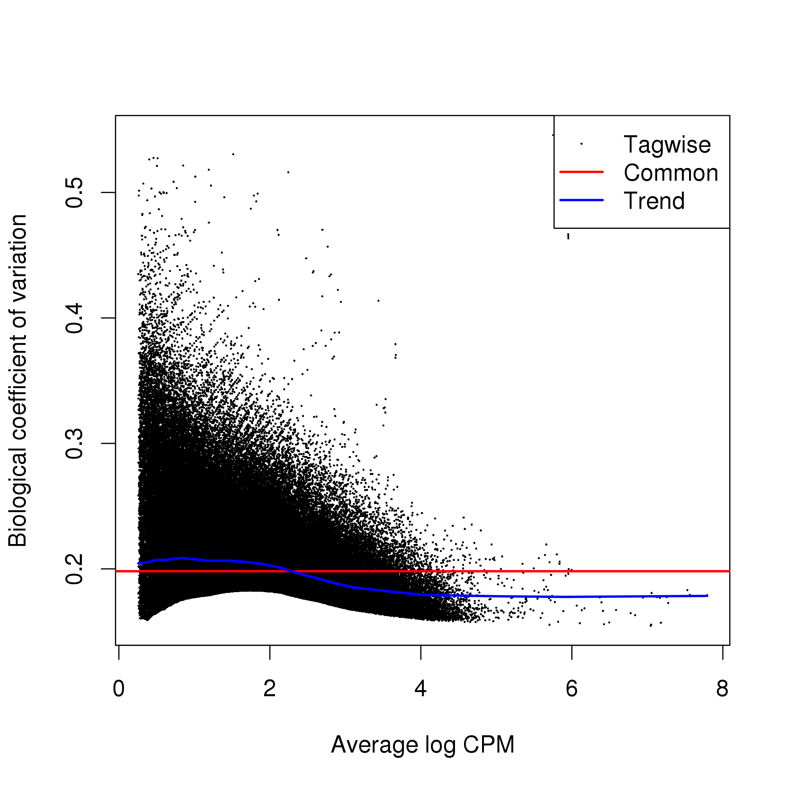
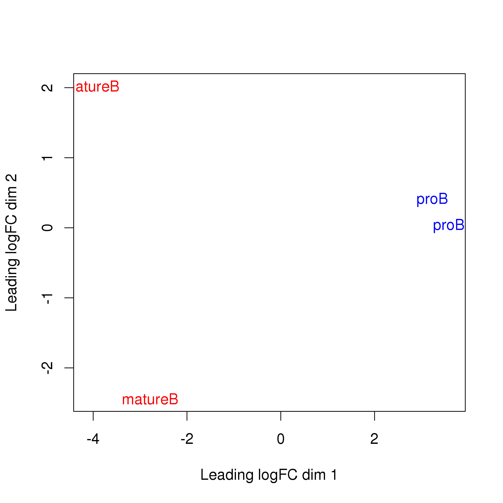
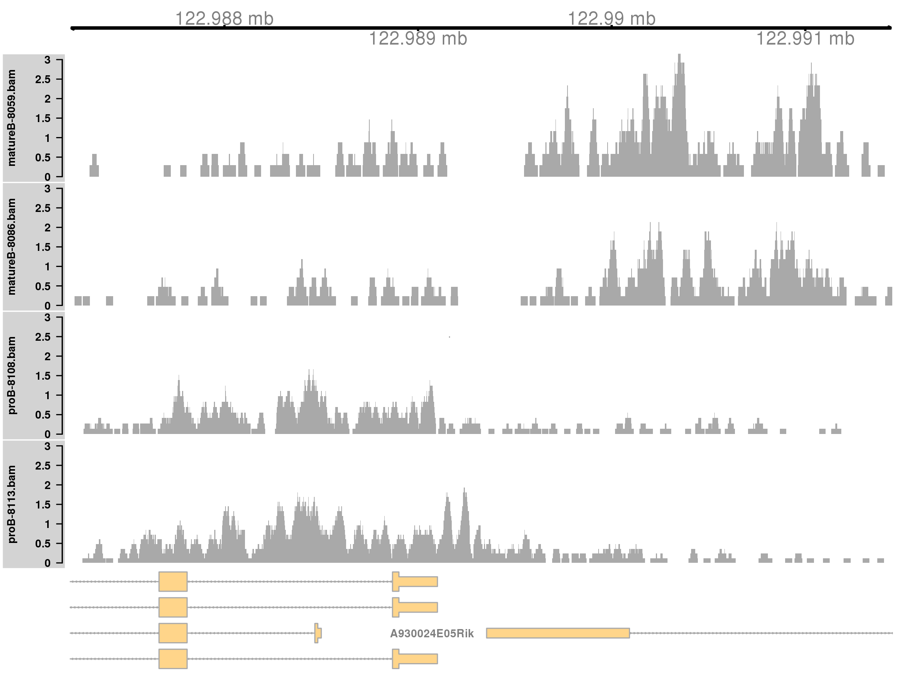
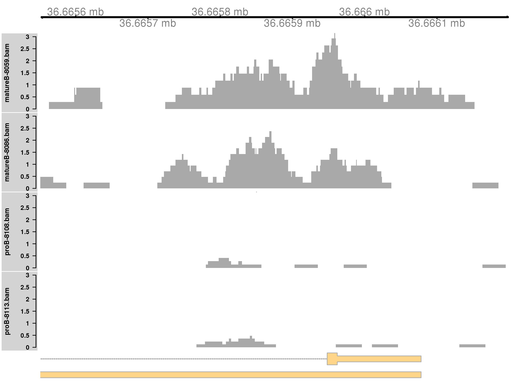
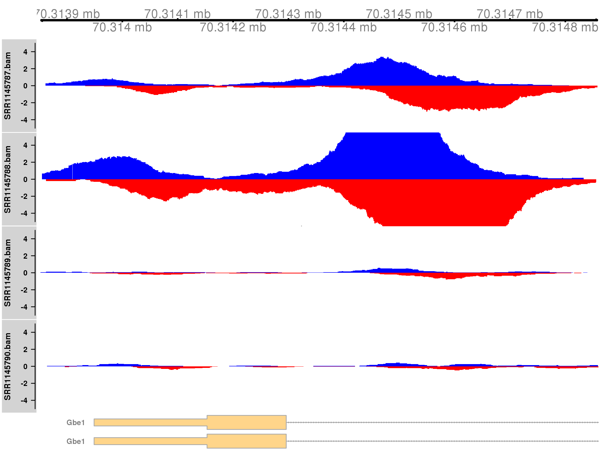

# Introduction

Chomatin immunoprecipitation with sequencing (ChIP-seq) is a popular technique for identifying genomic binding sites of a protein of interest.
Conventional analyses of ChIP-seq data involve looking for absolute binding (i.e., the presence or absence of a binding sites) based on peaks in the read coverage.
A number of recent studies have focused on the detection of changes in the binding profile between conditions [@rossinnes2012differential; @pal2013global].
These differential binding (DB) analyses involve counting reads into genomic intervals, and then testing those counts for significant differences between conditions.
This defines a set of putative DB regions for further examination.
DB analyses are easier to perform than their conventional counterparts, 
   as the effect of genomic biases is largely mitigated when counts for different libraries are compared for the same genomic region.
DB regions may also be more relevant as the change in binding can be associated with the biological difference between conditions.

The key step in the DB analysis is the manner in which reads are counted.
The most obvious strategy is to count reads into pre-defined regions of interest, like promoters or gene bodies [@pal2013global].
This is simple but will not capture changes outside of those regions.
*De novo* analyses do not depend on pre-specified regions, whereby empirically defined peaks or windows are used for read counting.
Peak-based methods are implemented in the *[DiffBind](http://bioconductor.org/packages/release/bioc/html/DiffBind.html)* and *[DBChIP](http://bioconductor.org/packages/release/bioc/html/DBChIP.html)* packages [@rossinnes2012differential; @liang2012detecting].
These packages take a set of peaks called using software like MACS [@zhang2008macs], count reads into those peaks, and test those counts for significant differences.
This requires some care to maintain statistical rigour, as peaks are called with the same data used to test for DB (i.e., data snooping).
Window-based approaches count reads into sliding windows and test each window for DB.
This is a more direct approach that avoids issues with data snooping and can provide increased DB detection power [@lun2014denovo].

This article describes a workflow for performing a window-based DB analysis, based primarily on Bioconductor packages [@huber2015orchestrating].
It contains all steps that are necessary for detecting DB regions, starting from the raw read sequences.
Reads are first aligned to the genome using the *[Rsubread](http://bioconductor.org/packages/release/bioc/html/Rsubread.html)* package [@liao2013subread].
These are counted into sliding windows with *[csaw](http://bioconductor.org/packages/release/bioc/html/csaw.html)*, to quantify binding intensity across the genome [@lun2014denovo].
Statistical modelling is based on the negative binomial (NB) distribution with generalized linear models (GLMs) 
    in the *[edgeR](http://bioconductor.org/packages/release/bioc/html/edgeR.html)* package [@robinson2010edger; @mccarthy2012differential], 
    with additional sophistication provided by quasi-likelihood (QL) methods [@lund2012ql].
Code is also provided for filtering, normalization and region-level control of the false discovery rate (FDR).
Finally, annotation and visualization of the DB regions is described.

Application of the methods in this article involves the use of two different ChIP-seq data sets.
The first data set studies changes in H3K9ac marking between pro-B and mature B cells [@domingo2012bcell].
The second data set studies changes in CREB-binding protein (CBP) binding between wild-type and CBP knock-out cells [@kasper2014genomewide].
A separate workflow is described for the analysis of each data set, using the sliding window approach but involving the use of different parameter settings.
The aim is to provide readers with a variety of usage examples from which they can construct analyses of their own data.

# Aligning reads in the H3K9ac libraries

The first task is to download the relevant ChIP-seq libraries from the NCBI Gene Expression Omnibus [@edgar2002geo].
These are obtained using the Sequence Read Accession (SRA) numbers listed below.
The experiment contains two biological replicates in total for each of the two cell types (pro-B and mature B cells).
Multiple technical replicates exist for some of the biological replicates, and are indicated as those files with the same `grouping`.


```r
sra.numbers <- c("SRR499718", "SRR499719", "SRR499720", "SRR499721", 
    "SRR499734", "SRR499735", "SRR499736", "SRR499737", "SRR499738")
grouping <- c("proB-8113", "proB-8113", "proB-8108", "proB-8108", 
    "matureB-8059", "matureB-8059", "matureB-8059", "matureB-8059", 
    "matureB-8086")
data.frame(SRA=sra.numbers, Condition=grouping)
```

```
##         SRA    Condition
## 1 SRR499718    proB-8113
## 2 SRR499719    proB-8113
## 3 SRR499720    proB-8108
## 4 SRR499721    proB-8108
## 5 SRR499734 matureB-8059
## 6 SRR499735 matureB-8059
## 7 SRR499736 matureB-8059
## 8 SRR499737 matureB-8059
## 9 SRR499738 matureB-8086
```

These files are downloaded in the SRA format, and need to be unpacked to the FASTQ format.
This can be done using the `fastq-dump` utility from the [SRA Toolkit](http://www.ncbi.nlm.nih.gov/Traces/sra/?view=software).


```r
all.sra <- paste0(sra.numbers, ".lite.sra")
for (sra in all.sra) {
    code <- system(paste("fastq-dump", sra))
    stopifnot(code==0L)
}
all.fastq <- paste0(sra.numbers, ".fastq")
```

Technical replicates are merged together prior to further processing. 
This reflects the fact that they originate from a single library of DNA fragments.


```r
by.group <- split(all.fastq, grouping)
for (group in names(by.group)) {
    code <- system(paste(c("cat", by.group[[group]], ">",
        paste0(group, ".fastq")), collapse=" "))
    stopifnot(code==0L)
}
group.fastq <- paste0(names(by.group), ".fastq")
```

Reads in each library are aligned to the mm10 build of the mouse genome, using the *[Rsubread](http://bioconductor.org/packages/release/bioc/html/Rsubread.html)* package [@liao2013subread].
This assumes that an index has already been constructed with the prefix `index/mm10`.
Here, a consensus threshold of 2 is used instead of the default of 3, to accommodate the shorter length of the reads (32 bp).


```r
require(Rsubread)
bam.files <- paste0(names(by.group), ".bam")
align(index="index/mm10", readfile1=group.fastq, TH1=2, 
    input_format="FASTQ", output_file=bam.files)
```

In each of the resulting BAM files, alignments are re-sorted by their mapping location.
This is required for input into *[csaw](http://bioconductor.org/packages/release/bioc/html/csaw.html)*, 
    but is also useful for other programs like genome browsers that depend on sorting and indexing for rapid retrieval of reads.


```r
require(Rsamtools)
for (bam in bam.files) {
    out <- sortBam(bam, destination="h3k9ac_temp")
    file.rename(out, bam)
}
```

```
## Warning in .local(file, destination, ...): [bam_sort_core] merging from 7
## files...
```

```
## Warning in .local(file, destination, ...): [bam_sort_core] merging from 3
## files...
```

```
## Warning in .local(file, destination, ...): [bam_sort_core] merging from 4
## files...
```

```
## Warning in .local(file, destination, ...): [bam_sort_core] merging from 4
## files...
```

Potential PCR duplicates are marked using the `MarkDuplicates` tool from the [Picard software suite](http://broadinstitute.github.io/picard).
These are identified as alignments at the same genomic location, such that they may have originated from PCR-amplified copies of the same DNA fragment.


```r
temp.bam <- "h3k9ac_temp.bam"
temp.file <- "h3k9ac_metric.txt"
temp.dir <- "h3k9ac_working"
dir.create(temp.dir)
for (bam in bam.files) {
    code <- system(sprintf("MarkDuplicates I=%s O=%s M=%s \\
        TMP_DIR=%s AS=true REMOVE_DUPLICATES=false \\ 
        VALIDATION_STRINGENCY=SILENT", bam, temp.bam,   
        temp.file, temp.dir))
    stopifnot(code==0L)
    file.rename(temp.bam, bam)
}
```

The alignment procedure for this data set can be easily summarized with some statistics.
Ideally, the proportion of mapped reads should be high, while the proportion of marked reads should be low.


```r
diagnostics <- list()
for (bam in bam.files) {
    total <- countBam(bam)$records
    mapped <- countBam(bam, param=ScanBamParam(
        flag=scanBamFlag(isUnmapped=FALSE)))$records
    marked <- countBam(bam, param=ScanBamParam(
        flag=scanBamFlag(isUnmapped=FALSE, isDuplicate=TRUE)))$records
    diagnostics[[bam]] <- c(Total=total, Mapped=mapped, Marked=marked)
}
diag.stats <- data.frame(do.call(rbind, diagnostics))
diag.stats$Prop.mapped <- diag.stats$Mapped/diag.stats$Total*100
diag.stats$Prop.marked <- diag.stats$Marked/diag.stats$Mapped*100
diag.stats
```

```
##                     Total  Mapped  Marked Prop.mapped Prop.marked
## matureB-8059.bam 16675372 7752077 1054591    46.48818   13.603980
## matureB-8086.bam  6347683 4899961  195100    77.19291    3.981664
## proB-8108.bam    10413135 8213980  297796    78.88095    3.625478
## proB-8113.bam    10724526 9145743  489177    85.27876    5.348685
```

Finally, the libraries are indexed for rapid retrieval by genomic location.
This generates a number of index files at the same location as the BAM files.


```r
indexBam(bam.files)
```


# Obtaining the ENCODE blacklist for mouse

A number of genomic regions contain high artifactual signal in ChIP-seq experiments.
These often correspond to genomic features like telomeres or microsatellite repeats.
For example, multiple tandem repeats in the real genome are reported as a single unit in the genome build.
Alignment of all (non-specifically immunoprecipitated) reads from the former will result in artificially high coverage of the latter.
Moreover, differences in repeat copy numbers between conditions can lead to detection of spurious DB.

As such, these regions must be removed prior to further analysis.
This can be done with an annotated blacklist of problematic regions in the 
    [mm9 build of the mouse genome](http://www.broadinstitute.org/~anshul/projects/mouse/blacklist/mm9-blacklist.bed.gz).
All reads in the blacklist will be ignored during processing in *[csaw](http://bioconductor.org/packages/release/bioc/html/csaw.html)*.
The blacklist itself was constructed by identifying consistently problematic regions in the ENCODE and modENCODE data sets [@encode2012encode].

Recall that the alignments have been performed to the mm10 build, so the mm9 blacklist coordinates must be transferred to their mm10 equivalents.
This is done using the `liftOver` function in the *[rtracklayer](http://bioconductor.org/packages/release/bioc/html/rtracklayer.html)* package [@lawrence2009rtracklayer].
The chain file specifies the corresponding locations in the two builds and can be obtained 
    [here](http://hgdownload-test.cse.ucsc.edu/goldenPath/mm9/liftOver/mm9ToMm10.over.chain.gz).
The new coordinates are then saved to file for future use.


```r
require(rtracklayer)
ch <- import.chain("mm9ToMm10.over.chain")
original <- import("mm9-blacklist.bed")
blacklist <- liftOver(x=original, chain=ch)
blacklist <- unlist(blacklist)
saveRDS(file="mm10-blacklist.rds", blacklist)
```

An alternative approach is to use predicted repeat regions from the UCSC genome annotation [@rosenbloom2015ucsc].
This tends to remove a greater number of problematic regions (especially microsatellites) compared to the ENCODE blacklist.
However, the size of the UCSC list means that genuine DB sites may also be removed.
Thus, the ENCODE blacklist is preferred for most applications.

# Testing for DB between pro-B and mature B cells

## Setting up the analysis parameters

Here, the settings for the DB analysis are specified.
The paths to the BAM files are stored in the `bam.files` vector from the previous section.
The cell type for each file can be conveniently extracted from the file name.


```r
celltype <- sub("-.*", "", bam.files)
data.frame(BAM=bam.files, CellType=celltype)
```

```
##                BAM CellType
## 1 matureB-8059.bam  matureB
## 2 matureB-8086.bam  matureB
## 3    proB-8108.bam     proB
## 4    proB-8113.bam     proB
```

In the *[csaw](http://bioconductor.org/packages/release/bioc/html/csaw.html)* package, the `readParam` object determines which reads are extracted from the BAM file.
The idea is to set this up once and to re-use it in all relevant functions.
For this analysis, reads are only used if they have a mapping quality score above 50.
This avoids spurious results due to weak or non-unique alignments.
Reads are also ignored if they map within blacklist regions or if they do not map to the standard set of chromosomes.


```r
require(csaw)
param <- readParam(minq=50, discard=blacklist,
    restrict=paste0("chr", c(1:19, "X", "Y")))
```

## Computing the average fragment length

For ChIP-seq experiments involving sharp binding, the average fragment length can be computed using cross-correlation plots [@kharchenko2008design].
The delay distance at the peak of cross-correlations corresponds to the distance between forward-/reverse-strand subpeaks.
This is identified from Figure 1 and is used as the average fragment length for this analysis.


```r
x <- correlateReads(bam.files, param=reform(param, dedup=TRUE))
frag.len <- which.max(x) - 1
frag.len
```

```
## [1] 148
```


```r
plot(1:length(x)-1, x, xlab="Delay (bp)", ylab="CCF", type="l")
abline(v=frag.len, col="red")
text(x=frag.len, y=min(x), paste(frag.len, "bp"), pos=4, col="red")
```

 

Only unmarked reads (i.e., not potential PCR duplicates) are used here.
This tends to give better signal by reducing the size of the "phantom" peak at the read length [@landt2012chipseq].
However, removal of marked reads is risky as it caps the signal in high-coverage regions of the genome.
This can result in loss of power to detect DB, or introduction of spurious DB when the same cap is applied to libraries of different sizes.
Thus, marking will be ignored in the rest of the analysis.

## Counting reads into windows

*[csaw](http://bioconductor.org/packages/release/bioc/html/csaw.html)* uses a sliding window strategy to examine binding across the genome.
Each read is directionally extended to the average fragment length, to represent the DNA fragment from which that read was sequenced.
The number of extended reads overlapping a window is counted.
The window is then moved to its next position on the genome, and counting is repeated.
This is done for all libraries such that a count is obtained for each window in each library.
The `windowCounts` function produces a `RangedSummarizedExperiment` object, where each row corresponds to a window and each column represents a library.


```r
win.data <- windowCounts(bam.files, param=param, width=150, ext=frag.len)
win.data
```

```
## class: SummarizedExperiment 
## dim: 1569624 4 
## exptData(4): spacing width shift final.ext
## assays(1): counts
## rownames: NULL
## rowRanges metadata column names(0):
## colnames: NULL
## colData names(4): bam.files totals ext param
```

For this analysis, a window size of 150 bp is used.
This corresponds roughly to the length of the DNA in a nucleosome [@humburg2011chipseqr], which is the smallest relevant unit for histone mark enrichment.
The spacing between windows is set to the default of 50 bp, i.e., adjacent window starts are 50 bp apart.
Windows with very low counts are removed by default to reduce memory use.

## Filtering windows by abundance

Low-abundance windows contain no binding sites and need to be filtered out.
This improves power by removing irrelevant tests prior to the multiple testing correction;
    avoids problems with discreteness in downstream statistical methods; 
    and reduces computational work for further analyses.
Here, filtering is performed using the average abundance of each window [@mccarthy2012differential].
This performs well as an independent filter statistic for NB-distributed count data [@lun2014denovo].

The filter threshold is defined based on the assumption that most regions in the genome are not marked by H3K9ac.
Reads are counted into large bins and the median coverage across those bins is used as an estimate of the background abundance.
Windows are only retained if they have abundances 3-fold higher than the background.
This removes a large number of windows that are weakly marked and likely to be irrelevant.


```r
bins <- windowCounts(bam.files, bin=TRUE, width=2000, param=param)
filter.stat <- filterWindows(win.data, bins, type="global")
min.fc <- 3
keep <- filter.stat$filter > log2(min.fc)
summary(keep)
```

```
##    Mode   FALSE    TRUE    NA's 
## logical  906406  663218       0
```

The effect of the fold-change threshold can be examined visually in Figure 2.
The chosen threshold is greater than the abundances of most bins in the genome -- presumably, those that contain background regions.
This suggests that the filter will remove most windows lying within background regions.


```r
hist(filter.stat$back.abundances, xlab="Background abundance", main="", breaks=50)
threshold <- filter.stat$abundances[1] - filter.stat$filter[1] + log2(min.fc)
abline(v=threshold, col="red")
```

 

The actual filtering itself is done by simply subsetting the `RangedSummarizedExperiment` object.


```r
filtered.data <- win.data[keep,]
```

## Normalizing for library-specific trended biases

Normalization is required prior to any comparisons between libraries, to eliminate confounding library-specific biases.
In particular, a trended bias is often observed between libraries in Figure 3.
This refers to a systematic fold-difference in window coverage between libraries that changes according to the average abundance of the window.


```r
win.ab <- filter.stat$abundances[keep]
adjc <- log2(assay(filtered.data)+0.5)
logfc <- adjc[,1] - adjc[,4]
smoothScatter(win.ab, logfc, ylim=c(-6, 6),
    xlab="Average abundance", ylab="Log-fold change")
fit <- limma::loessFit(x=win.ab, y=logfc)
o <- order(win.ab)
lines(win.ab[o], fit$fitted[o], col="red")
```

 

Trended biases are refractory to scaling methods like TMM normalization [@robinson2010scaling], as the scaling factor needs to vary with abundance.
Rather, non-linear normalization methods must be used.
*[csaw](http://bioconductor.org/packages/release/bioc/html/csaw.html)* implements a version of the fast loess method [@ballman2004fast] that is adapted to count data.
This produces a matrix of offsets that can be used during GLM fitting.


```r
offsets <- normalize(filtered.data, type="loess")
head(offsets)
```

```
##            [,1]       [,2]      [,3]      [,4]
## [1,] -0.5878496 -0.4019382 0.3954267 0.5943611
## [2,] -0.5673338 -0.3789731 0.3770978 0.5692091
## [3,] -0.6261679 -0.4720746 0.4397909 0.6584516
## [4,] -0.6528790 -0.5453416 0.4789700 0.7192507
## [5,] -0.6713098 -0.5838111 0.5015881 0.7535328
## [6,] -0.7028331 -0.6463783 0.5390876 0.8101237
```

The effect of non-linear normalization can be visualized a mean-difference plot comparing the first and last libraries.
Once the offsets are applied to adjust the log-fold changes, the trend is eliminated from the plot (Figure 4).
This indicates that normalization was successful. 


```r
par(mfrow=c(1,2), cex.lab=1.5)
smoothScatter(win.ab, logfc, ylim=c(-6, 6), main="Before",
    xlab="Average abundance", ylab="Log-fold change")
norm.adjc <- adjc - offsets/log(2)
smoothScatter(win.ab, norm.adjc[,1]-norm.adjc[,4], ylim=c(-6, 6),
    main="After", xlab="Average abundance", ylab="Log-fold change")
```

 

The implicit assumption of non-linear methods is that most windows at each abundance are not DB.
Any systematic difference is attributed to bias and is removed.
This assumption is not appropriate when large-scale DB is expected.
However, there is no indication that such changes are present in this data set, so non-linear methods can be applied without too much concern.

## Statistical modelling of biological variability 

### Introduction

Counts are modelled using NB GLMs in the *[edgeR](http://bioconductor.org/packages/release/bioc/html/edgeR.html)* package [@mccarthy2012differential; @robinson2010edger].
The NB distribution is useful as it can handle low, discrete counts for each window.
The NB dispersion parameter allows modelling of biological variability between replicate libraries.
GLMs can also accommodate complex experimental designs, though a simple design is sufficient for this study.


```r
celltype <- factor(celltype)
design <- model.matrix(~0+celltype)
colnames(design) <- levels(celltype)
design
```

```
##   matureB proB
## 1       1    0
## 2       1    0
## 3       0    1
## 4       0    1
## attr(,"assign")
## [1] 1 1
## attr(,"contrasts")
## attr(,"contrasts")$celltype
## [1] "contr.treatment"
```

### Estimating the NB dispersion

The `RangedSummarizedExperiment` object is coerced into a `DGEList` object (plus offsets) prior to entry into *[edgeR](http://bioconductor.org/packages/release/bioc/html/edgeR.html)*.
Estimation of the NB dispersion is then performed.
Specifically, a NB dispersion trend is fitted to all windows against the average abundance.
This means that empirical mean-dispersion trends can be flexibly modelled.


```r
require(edgeR)
y <- asDGEList(filtered.data)
y$offset <- offsets
y <- estimateDisp(y, design)
summary(y$trended.dispersion)
```

```
##    Min. 1st Qu.  Median    Mean 3rd Qu.    Max. 
## 0.03156 0.04174 0.04274 0.04168 0.04311 0.04371
```

The NB dispersion trend is visualized in Figure 5 as the biological coefficient of variation (BCV), i.e., the square root of the NB dispersion.
A trend that decreases to a plateau with increasing abundance is typical of many analyses, including those of RNA-seq and ChIP-seq data.
Note that only the trended dispersion will be used here -- the common and tagwise values are only shown for completeness.


```r
plotBCV(y)
```

 

### Estimating the QL dispersion

Additional modelling is provided with the QL methods in *[edgeR](http://bioconductor.org/packages/release/bioc/html/edgeR.html)* [@lund2012ql].
This introduces a QL dispersion parameter for each window, which captures variability in the NB dispersion around the fitted trend for each window.
Thus, the QL dispersion can model window-specific variability, whereas the NB dispersion trend is averaged across many windows.
However, with limited replicates, there is not enough information for each window to stably estimate the QL dispersion.
This is overcome by sharing information between windows with empirical Bayes (EB) shrinkage.
The instability of the QL dispersion estimates is reduced by squeezing the estimates towards an abundance-dependent trend (Figure 6).


```r
fit <- glmQLFit(y, design, robust=TRUE)
plotQLDisp(fit)
```

 

The extent of shrinkage is determined by the prior degrees of freedom (d.f.).
Large prior d.f. indicates that the dispersions were similar across windows, such that strong shrinkage to the trend could be performed to increase stability and power.
Small prior d.f. indicates that the dispersions were more variable.
In such cases, less squeezing is performed as strong shrinkage would be inappropriate.
Also note the use of `robust=TRUE`, which reduces the sensitivity of the EB procedures to outlier windows.


```r
summary(fit$df.prior)
```

```
##    Min. 1st Qu.  Median    Mean 3rd Qu.    Max. 
##  0.4903 22.6900 22.6900 22.6900 22.6900 22.6900
```

### Examining the data with MDS plots

Multi-dimensional scaling (MDS) plots can be used to examine the similarities between libraries.
The distance between a pair of libraries on this plot represents the overall log-fold change between those libraries.
Ideally, replicates should cluster together while samples from different conditions should be separate.
In Figure 7, strong separation in the first dimension is observed between libraries from different cell types.
This indicates that significant differences are likely to be present between cell types in this data set.


```r
plotMDS(norm.adjc, labels=celltype,
    col=c("red", "blue")[as.integer(celltype)])
```

 

## Testing for DB and controlling the FDR

### Testing for DB with QL F-tests

Each window is tested for significant differences between cell types using the QL F-test [@lund2012ql].
This is superior to the likelihood ratio test that is typically used for GLMs, as the QL F-test accounts for the uncertainty in dispersion estimation.
One *p*-value is produced for each window, representing the evidence against the null hypothesis (i.e., no DB).
For this analysis, the comparison is parametrized such that the reported log-fold changes represent that of pro-B cells over mature B counterparts.


```r
con <- makeContrasts(proB-matureB, levels=design)
res <- glmQLFTest(fit, contrast=con)
head(res$table)
```

```
##       logFC    logCPM         F     PValue
## 1 0.8071199 0.3987193 0.9350894 0.34292110
## 2 0.7892698 0.3531386 0.8977361 0.35257125
## 3 2.0508458 0.5770295 5.3124205 0.02987028
## 4 1.1952436 0.8317769 2.6800790 0.11429478
## 5 0.9751114 0.9868770 2.0577431 0.16397982
## 6 0.6472745 1.2487216 1.0906847 0.30643720
```

### Controlling the FDR across regions

One might attempt to control the FDR by applying the Benjamini-Hochberg (BH) method to the window-level *p*-values [@benjamini1995controlling].
However, the features of interest are not windows, but the genomic regions that they represent.
Control of the FDR across windows does not guarantee control of the FDR across regions [@lun2014denovo].
The latter is arguably more relevant for final intepretation of the results.

Control of the region-level FDR can be provided by aggregating windows into regions and combining the *p*-values.
Here, adjacent windows less than 100 bp apart are aggregated into clusters.
Each cluster represents a genomic region.
Smaller values of `tol` allow distinct marking events to kept separate, 
   while larger values provide a broader perspective, e.g., by considering adjacent co-regulated sites as a single entity.
Chaining effects are mitigated by setting a maximum cluster width of 5 kbp.


```r
merged <- mergeWindows(rowRanges(filtered.data), 
    tol=100, max.width=5000)
```

A combined *p*-value is computed for each cluster using the method of @simes1986, based on the *p*-values of the constituent windows.
This represents the evidence against the global null hypothesis for each cluster, i.e., that no DB exists in any of its windows.
Rejection of this global null indicates that the cluster (and the region that it represents) contains DB.
Applying the BH method to the combined *p*-values allows the region-level FDR to be controlled.


```r
merged <- mergeWindows(rowRanges(filtered.data), 
    tol=100, max.width=5000)
tabcom <- combineTests(merged$id, res$table)
head(tabcom)
```

```
##   nWindows logFC.up logFC.down     PValue        FDR
## 1        2        2          0 0.35257125 0.48433052
## 2       24       10          0 0.03965980 0.09329214
## 3        8        1          3 0.38231836 0.51205966
## 4       11        1          2 0.84578866 0.91987081
## 5       36       14          6 0.01481647 0.04558244
## 6       18        7          9 0.00671594 0.02656732
```

Each row of the output table contains the statistics for a single cluster, including the combined *p*-value before and after the BH correction.
The `nWindows` field describes the total number of windows in the cluster.
The `logFC.up` and `logFC.down` fields describe the number of windows with a log-fold change above 0.5 or below -0.5 in each cluster.
This can be used to determine the direction of DB in each cluster.

### Examining the scope and direction of DB

The total number of DB regions at a FDR of 5% can be easily calculated.


```r
is.sig <- tabcom$FDR <= 0.05
summary(is.sig)
```

```
##    Mode   FALSE    TRUE    NA's 
## logical   26121   13402       0
```

Determining the direction of DB is more complicated, as clusters could potentially contain windows that are changing in opposite directions.
One approach is to define the direction based on the number of windows changing in each direction, as described above.
Another approach is to use the log-fold change of the most significant window as a proxy for the log-fold change of the cluster.
This is generally satisfactory, though it will not capture multiple changes in opposite directions.
It also tends to overstate the change in each cluster.


```r
tabbest <- getBestTest(merged$id, res$table)
head(tabbest)
```

```
##   best      logFC    logCPM          F     PValue        FDR
## 1    1  0.8071199 0.3987193  0.9350894 0.68584219 0.89635068
## 2   14  6.4894914 0.7814903 12.3651181 0.04305271 0.10940477
## 3   29 -0.8951569 1.4182105  3.1716524 0.70058621 0.91053977
## 4   42 -0.9100013 0.9724194  2.4590005 1.00000000 1.00000000
## 5   64  6.5014465 0.7867585 14.3069870 0.03337001 0.09138600
## 6   88  6.5134616 0.7920288 15.6865615 0.01067998 0.04156789
```

In the above table, each row contains the statistics for each cluster.
Of interest are the `best` and `logFC` fields.
The former is the index of the window that is the most significant in each cluster, while the latter is the log-fold change of that window.
This can be used to obtain an overview of the direction of DB across all clusters.


```r
is.sig.pos <- (tabbest$logFC > 0)[is.sig]
summary(is.sig.pos)
```

```
##    Mode   FALSE    TRUE    NA's 
## logical    8137    5265       0
```

## Saving results to file

Results can be saved to file prior to further manipulation.
One approach is to store all statistics in the metadata of a `GRanges` object.
This is useful as it keeps the statistics and coordinates together for each cluster, avoiding problems with synchronization in downstream steps.
The midpoint and log-fold change of the best window is also stored.


```r
out.ranges <- merged$region
elementMetadata(out.ranges) <- data.frame(tabcom,
    best.pos=mid(ranges(rowRanges(filtered.data[tabbest$best]))),
    best.logFC=tabbest$logFC)
saveRDS(file="h3k9ac_results.rds", out.ranges)
```

For input into other programs like genome browsers, results can be saved in a more conventional format.
Here, coordinates of DB regions are saved in BED format, using a log-transformed FDR as the score.

```
simplified <- out.ranges[is.sig]
simplified$score <- -10*log10(simplified$FDR)
export(con="h3k9ac_results.bed", object=simplified)
```

Saving the `RangedSummarizedExperiment` objects is also recommended.
This avoids the need to re-run the time-consuming read counting steps if parts of the analysis need to be performed.
Similarly, the `DGEList` object is saved so that the *[edgeR](http://bioconductor.org/packages/release/bioc/html/edgeR.html)* statistics can be easily recovered.


```r
save(file="h3k9ac_objects.Rda", win.data, bins, y)
```

# Interpreting the DB results

## Adding annotation

### Using the `detailRanges` function

*[csaw](http://bioconductor.org/packages/release/bioc/html/csaw.html)* provides its own annotation function, `detailRanges`.
This identifies all genic features overlapping each region and reports them in a compact string form.
Briefly, features are reported as `SYMBOL|EXONS|STRAND` where `SYMBOL` represents the gene symbol,
    `EXONS` lists the overlapping exons (`0` for promoters, `I` for introns),
    and `STRAND` reports the strand.
Multiple features for different genes are separated by commas within each string.


```r
require(org.Mm.eg.db)
require(TxDb.Mmusculus.UCSC.mm10.knownGene)
anno <- detailRanges(out.ranges, orgdb=org.Mm.eg.db,
    txdb=TxDb.Mmusculus.UCSC.mm10.knownGene)
head(anno$overlap)
```

```
## [1] "Mrpl15|5|-"    "Mrpl15|0-1|-"  "Lypla1|0|+"    "Lypla1|0,2|+" 
## [5] "Tcea1|0-2|+"   "Atp6v1h|0-1|+"
```

Annotated features that flank the region of interest are also reported.
The description for each feature is similarly formatted but with an extra `[DISTANCE]` field, 
    representing the distance (in base pairs) between that feature and the region.
By default, only flanking features within 5 kbp of each region are considered.


```r
head(anno$left)
```

```
## [1] "Mrpl15|6|-[935]"   "Mrpl15|2-3|-[896]" ""                 
## [4] "Lypla1|1|+[19]"    ""                  ""
```

```r
head(anno$right)
```

```
## [1] "Mrpl15|4|-[1875]"  ""                  "Lypla1|1-2|+[143]"
## [4] ""                  ""                  "Atp6v1h|2|+[517]"
```

The annotation for each region can then be stored in metadata of the `GRanges` object.
The compact string form is useful for human interpretation, as it allows rapid examination of all genic features neighbouring each region.


```r
meta <- elementMetadata(out.ranges) 
elementMetadata(out.ranges) <- data.frame(meta, anno)
```

### Using the *[ChIPpeakAnno](http://bioconductor.org/packages/release/bioc/html/ChIPpeakAnno.html)* package.

As its name suggests, the *[ChIPpeakAnno](http://bioconductor.org/packages/release/bioc/html/ChIPpeakAnno.html)* package is designed to annotate peaks from ChIP-seq experiments [@zhu2010chippeakanno].
A `GRanges` object containing all regions of interest is supplied to the relevant function, after removing all previous metadata fields to reduce clutter.
The gene closest to each region is then reported.
Gene coordinates are taken from the NCBI mouse 38 annotation, which is equivalent to the annotation for the mm10 build.


```r
require(ChIPpeakAnno)
data(TSS.mouse.GRCm38)
minimal <- out.ranges
elementMetadata(minimal) <- NULL
anno.regions <- annotatePeakInBatch(minimal, AnnotationData=TSS.mouse.GRCm38)
elementMetadata(anno.regions)
```

```
## DataFrame with 39549 rows and 9 columns
##              peak            feature start_position end_position
##       <character>        <character>      <integer>    <integer>
## 1           00001 ENSMUSG00000033845        4773207      4785739
## 2           00002 ENSMUSG00000033845        4773207      4785739
## 3           00003 ENSMUSG00000025903        4807789      4886770
## 4           00004 ENSMUSG00000025903        4807789      4886770
## 5           00005 ENSMUSG00000033813        4857815      4897909
## ...           ...                ...            ...          ...
## 39545       39519 ENSMUSG00000069049        1010544      1028847
## 39546       39520 ENSMUSG00000069049        1010544      1028847
## 39547       39521 ENSMUSG00000068457        1096862      1245759
## 39548       39522 ENSMUSG00000069045        1260716      1286613
## 39549       39523 ENSMUSG00000095950       10533731     10534428
##       feature_strand insideFeature distancetoFeature shortestDistance
##          <character>      <factor>         <numeric>        <integer>
## 1                  -        inside             10288             2244
## 2                  -  overlapStart               738              561
## 3                  +      upstream              -538               39
## 4                  +        inside               212              212
## 5                  +  overlapStart              -764              764
## ...              ...           ...               ...              ...
## 39545              +      upstream             -1043              794
## 39546              +  overlapStart              -243              243
## 39547              -  overlapStart               908               91
## 39548              -  overlapStart               862               87
## 39549              -    downstream             26377            25381
##       fromOverlappingOrNearest
##                    <character>
## 1              NearestLocation
## 2              NearestLocation
## 3              NearestLocation
## 4              NearestLocation
## 5              NearestLocation
## ...                        ...
## 39545          NearestLocation
## 39546          NearestLocation
## 39547          NearestLocation
## 39548          NearestLocation
## 39549          NearestLocation
```

The behaviour of *[ChIPpeakAnno](http://bioconductor.org/packages/release/bioc/html/ChIPpeakAnno.html)* complements that of  `detailRanges`.
The latter reports all overlapping and flanking genes, while the former reports only the closest gene (but in greater detail).
Which is preferable depends on the user and the purpose of the annotation.

### Reporting gene-based results

Another approach is to flip the problem around, such that DB statistics are reported directly for features of interest like genes.
This is more convenient when the DB analysis needs to be integrated with, e.g., DE analyses of matching RNA-seq data.
In this case, promoter coordinates are obtained by running `detailRanges` without specifying any regions.
All windows overlapping each promoter are defined as a cluster, and DB statistics are computed as previously described.
This yields results for annotated features (with some `NA` values, marking those promoters that have no overlapping windows).


```r
anno.ranges <- detailRanges(orgdb=org.Mm.eg.db, 
   txdb=TxDb.Mmusculus.UCSC.mm10.knownGene)
promoters <- anno.ranges[anno.ranges$exon==0L]
olap <- findOverlaps(promoters, rowRanges(filtered.data))
tabprom <- combineOverlaps(olap, res$table)
head(data.frame(Gene=promoters$symbol, tabprom)[!is.na(tabprom$PValue),])
```

```
##       Gene nWindows logFC.up logFC.down       PValue          FDR
## 6  Ldlrap1       19       11          0 2.247414e-01 0.2705479855
## 7     Mdn1       29       12         11 4.447727e-06 0.0001347924
## 8    Pydc3        8        0          6 5.118340e-02 0.0781822366
## 9   Wfdc17        6        0          6 6.960492e-05 0.0008738790
## 10  Mfap1b       19        1         10 1.071166e-01 0.1440819313
## 13 Gm15772       30       12          7 8.554344e-02 0.1192823092
```

Note that this is distinct from counting reads across promoters.
Using promoter-level counts would not provide enough spatial resolution to detect sharp binding events that only occur in a subinterval of the promoter.
In particular, detection may be compromised by non-specific background or the presence of multiple opposing DB events in the same promoter.
Combining window-level statistics is preferable as resolution is maintained for optimal performance.

## Visualizing DB results

### Overview

Here, the *[Gviz](http://bioconductor.org/packages/release/bioc/html/Gviz.html)* package is used to visualize read coverage at regions of interest.
Coverage in each BAM file will be represented by a single track.
Several additional tracks will also be included in each plot.
One is the genome axis track, to display the genomic coordinates across the plotted region.
The other is the annotation track containing gene models, with gene IDs replaced by symbols (where possible) for easier reading.


```r
require(Gviz)
gax <- GenomeAxisTrack(col="black", fontsize=15)
greg <- GeneRegionTrack(TxDb.Mmusculus.UCSC.mm10.knownGene, 
    showId=TRUE, geneSymbol=TRUE, name="UCSC genes", 
    col.title="black")
symbols <- unlist(mapIds(org.Mm.eg.db, gene(greg), "SYMBOL", 
    "ENTREZID", multiVals = "first"))
symbol(greg) <- symbols[gene(greg)]
```

### Simple DB across a broad region

To begin with, the top-ranking DB region will be visualized. 
This represents a simple DB event where the entire region changes in one direction (Figure 8).
Specifically, it represents an increase in H3K9ac marking at the *H2-Aa* locus.
This is consistent with the expected biology -- 
    H3K9ac is a mark of active gene expression [@karmodiya2012h3k9] 
    and MHCII components are upregulated in mature B cells [@hoffman2002changes].


```r
o <- order(out.ranges$PValue)
cur.region <- out.ranges[o[1]]
cur.region
```

```
## GRanges object with 1 range and 10 metadata columns:
##       seqnames               ranges strand |  nWindows  logFC.up
##          <Rle>            <IRanges>  <Rle> | <integer> <integer>
##   [1]    chr17 [34285101, 34289950]      * |        94         0
##       logFC.down       PValue          FDR  best.pos best.logFC
##        <integer>    <numeric>    <numeric> <integer>  <numeric>
##   [1]         94 4.471753e-14 1.195279e-09  34287575  -7.176575
##                                 overlap             left    right
##                                <factor>         <factor> <factor>
##   [1] H2-Aa|0-1|-,H2-Eb1|I|+,Notch4|I|+ H2-Aa|2-6|-[278]         
##   -------
##   seqinfo: 21 sequences from an unspecified genome
```


One track is plotted for each library, in addition to the coordinate and annotation tracks.
Coverage is plotted in terms of sequencing depth-per-million at each base.
This corrects for differences in library sizes between tracks.


```r
collected <- list()
lib.sizes <- filtered.data$totals/1e6
for (i in 1:length(bam.files)) { 
    reads <- extractReads(bam.file=bam.files[i], cur.region, param=param)
    cov <- as(coverage(reads)/lib.sizes[i], "GRanges")
    collected[[i]] <- DataTrack(cov, type="histogram", lwd=0, ylim=c(0,10), 
        name=bam.files[i], col.axis="black", col.title="black",
        fill="darkgray", col.histogram=NA)
}
plotTracks(c(gax, collected, greg), from=start(cur.region), to=end(cur.region))
```

```
## Warning in plotTracks(c(gax, collected, greg), from = start(cur.region), :
## The track chromosomes in 'trackList' differ. Setting all tracks to
## chromosome 'chr17'
```

 

### Complex DB across a broad region

Complex DB can also be visualized, where multiple DB events are occuring within the same enriched region.
These are identified as those clusters that contain windows changing in both directions.
Here, the second-ranking complex cluster is selected for visualization 
    (the top-ranking complex cluster is adjacent to the region used in the previous example, so another region is chosen for some variety).


```r
complex <- out.ranges$logFC.up > 0 & out.ranges$logFC.down > 0
cur.region <- out.ranges[o[complex[o]][2]]
cur.region
```

```
## GRanges object with 1 range and 10 metadata columns:
##       seqnames                 ranges strand |  nWindows  logFC.up
##          <Rle>              <IRanges>  <Rle> | <integer> <integer>
##   [1]     chr5 [122987201, 122991450]      * |        83        17
##       logFC.down       PValue          FDR  best.pos best.logFC
##        <integer>    <numeric>    <numeric> <integer>  <numeric>
##   [1]         43 2.201102e-10 1.962277e-07 122990925  -5.466918
##                               overlap              left
##                              <factor>          <factor>
##   [1] A930024E05Rik|0-1|+,Kdm2b|0-3|- Kdm2b|4-5|-[2661]
##                         right
##                      <factor>
##   [1] A930024E05Rik|2|+[2913]
##   -------
##   seqinfo: 21 sequences from an unspecified genome
```


This region contains a bidirectional promoter where different genes are marked in the different cell types (Figure 9).
Upon differentiation to mature B cells, loss of marking in one part of the region is balanced by a gain in marking in another part of the region.
This represents a complex DB event that would not be detected if reads were counted across the entire region.


```r
collected <- list()
for (i in 1:length(bam.files)) { 
    reads <- extractReads(bam.file=bam.files[i], cur.region, param=param)
    cov <- as(coverage(reads)/lib.sizes[i], "GRanges")
    collected[[i]] <- DataTrack(cov, type="histogram", lwd=0, ylim=c(0,3), 
        name=bam.files[i], col.axis="black", col.title="black",
    	fill="darkgray", col.histogram=NA)
}
plotTracks(c(gax, collected, greg), from=start(cur.region), to=end(cur.region))
```

```
## Warning in plotTracks(c(gax, collected, greg), from = start(cur.region), :
## The track chromosomes in 'trackList' differ. Setting all tracks to
## chromosome 'chr5'
```

 

### Simple DB across a small region

Both of the above regions are quite large, spanning several kilobases.
However, *[csaw](http://bioconductor.org/packages/release/bioc/html/csaw.html)* is equally capable of detecting sharp DB events.
This can be demonstrated by examining those clusters that contain a smaller number of windows.


```r
sharp <- out.ranges$nWindows < 20
cur.region <- out.ranges[o[sharp[o]][1]]
cur.region
```

```
## GRanges object with 1 range and 10 metadata columns:
##       seqnames               ranges strand |  nWindows  logFC.up
##          <Rle>            <IRanges>  <Rle> | <integer> <integer>
##   [1]    chr16 [36665551, 36666200]      * |        11         0
##       logFC.down       PValue          FDR  best.pos best.logFC    overlap
##        <integer>    <numeric>    <numeric> <integer>  <numeric>   <factor>
##   [1]         11 3.412784e-10 2.593913e-07  36665925  -4.887727 Cd86|0-1|-
##           left    right
##       <factor> <factor>
##   [1]                  
##   -------
##   seqinfo: 21 sequences from an unspecified genome
```


Marking is increased for mature B cells within a 500 bp region (Figure 10), which is sharper than the changes in the previous two examples.
This also coincides with the promoter of the *Cd86* gene.
Again, this makes biological sense as Cd86 is involved in regulating immunoglobulin production in activated B-cells [@podojil2003selective].
	

```r
collected <- list()
for (i in 1:length(bam.files)) { 
    reads <- extractReads(bam.file=bam.files[i], cur.region, param=param)
    cov <- as(coverage(reads)/lib.sizes[i], "GRanges")
    collected[[i]] <- DataTrack(cov, type="histogram", lwd=0, ylim=c(0,3), 
        name=bam.files[i], col.axis="black", col.title="black",
	fill="darkgray", col.histogram=NA)
}
plotTracks(c(gax, collected, greg), from=start(cur.region), to=end(cur.region))
```

```
## Warning in plotTracks(c(gax, collected, greg), from = start(cur.region), :
## The track chromosomes in 'trackList' differ. Setting all tracks to
## chromosome 'chr16'
```

 

# Repeating the analysis for the CBP data

## Overview

A window-based DB analysis will be shown here for transcription factor (TF) data, to complement the histone-based analysis above.
This data set compares CBP binding between wild-type (WT) and CBP knock-out (KO) animals [@kasper2014genomewide].
The aim is to use *[csaw](http://bioconductor.org/packages/release/bioc/html/csaw.html)* and other Bioconductor packages to identify DB sites between genotypes.
Most, if not all, of these sites should be increased in the WT, given that protein function should be compromised in the KO genotype.

## Aligning reads from CBP libraries

Libraries are downloaded from the NCBI using the SRA accessions below.
The data set contains two biological replicates for each of the two genotypes.
One file is present per library, i.e., no technical replicates.


```r
sra.numbers <- c("SRR1145787", "SRR1145788", "SRR1145789", "SRR1145790")
genotype <- c("wt", "wt", "ko", "ko")
data.frame(SRA=sra.numbers, Condition=genotype)
```

```
##          SRA Condition
## 1 SRR1145787        wt
## 2 SRR1145788        wt
## 3 SRR1145789        ko
## 4 SRR1145790        ko
```

SRA files are unpacked to yield FASTQ files with the raw read sequences.


```r
all.sra <- paste0(sra.numbers, ".sra")
for (sra in all.sra) { 
    code <- system(paste("fastq-dump", sra))
    stopifnot(code==0L)
}
all.fastq <- paste0(sra.numbers, ".fastq")
```

Reads are aligned to the mm10 genome using *[Rsubread](http://bioconductor.org/packages/release/bioc/html/Rsubread.html)*.
Here, the default consensus threshold is used as the reads are longer (75 bp).
A Phred offset of +64 is also used, instead of the +33 used in the previous data set.


```r
bam.files <- paste0(sra.numbers, ".bam")
align(index="index/mm10", readfile1=all.fastq, phredOffset=64, 
    input_format="FASTQ", output_file=bam.files)
```

Alignments in each BAM file are sorted by coordinate.
Duplicate reads are marked, and the resulting files are indexed.


```r
temp.bam <- "cbp_temp.bam"
temp.file <- "cbp_metric.txt"
temp.dir <- "cbp_working"
dir.create(temp.dir)
for (bam in bam.files) {
    out <- sortBam(bam, destination="cbp_temp")
    file.rename(out, bam)
    code <- system(sprintf("MarkDuplicates I=%s O=%s M=%s \\
        TMP_DIR=%s AS=true REMOVE_DUPLICATES=false \\
        VALIDATION_STRINGENCY=SILENT", 
        bam, temp.bam, temp.file, temp.dir))
    stopifnot(code==0L)
    file.rename(temp.bam, bam)
}
```

```
## Warning in .local(file, destination, ...): [bam_sort_core] merging from 18
## files...
```

```
## Warning in .local(file, destination, ...): [bam_sort_core] merging from 16
## files...
```

```
## Warning in .local(file, destination, ...): [bam_sort_core] merging from 22
## files...
```

```
## Warning in .local(file, destination, ...): [bam_sort_core] merging from 20
## files...
```

```r
indexBam(bam.files)
```

Some mapping statistics can be reported as previously described.
For brevity, the code will not be shown here, as it is identical to that used for the H3K9ac analysis.


```
##                   Total   Mapped  Marked Prop.mapped Prop.marked
## SRR1145787.bam 28525952 24015041 2244935    84.18664    9.348037
## SRR1145788.bam 25514465 21288115 2062157    83.43547    9.686893
## SRR1145789.bam 34476967 28830024 2678297    83.62111    9.289958
## SRR1145790.bam 32624587 27067108 2912659    82.96537   10.760880
```

## Detecting DB between genotypes for CBP 

### Counting reads into windows

First, the average fragment length is estimated by maximizing the cross-correlation function.


```r
param <- readParam(minq=50, discard=blacklist)
x <- correlateReads(bam.files, param=reform(param, dedup=TRUE))
frag.len <- which.max(x) - 1
frag.len
```

```
## [1] 162
```

Reads are then counted into sliding windows.
For TF data analyses, smaller windows are necessary to capture sharp binding sites.
A large window size will be suboptimal as the count for a particular site will be "contaminated" by non-specific background in the neighbouring regions.
In this case, a window size of 10 bp is used.


```r
win.data <- windowCounts(bam.files, param=param, width=10, ext=frag.len)
win.data
```

```
## class: SummarizedExperiment 
## dim: 9127613 4 
## exptData(4): spacing width shift final.ext
## assays(1): counts
## rownames: NULL
## rowRanges metadata column names(0):
## colnames: NULL
## colData names(4): bam.files totals ext param
```

### Normalization for composition biases

Composition biases are introduced when the amount of DB in each condition is unbalanced [@robinson2010scaling; @lun2014denovo].
More binding in one condition means that more reads are sequenced at the binding sites, leaving fewer reads for the rest of the genome.
This suppresses the genomic coverage at non-DB sites, resulting in spurious differences between libraries.
To remove this bias, reads are counted into large genomic bins.
Most bins are assumed to represent non-DB background regions.
Any systematic differences in the coverage of those bins is attributed to composition bias and is normalized out.
Specifically, the TMM method [@robinson2010scaling] is applied to compute normalization factors from the bin counts.
These factors can then be applied to the DB analysis with the window counts.


```r
bins <- windowCounts(bam.files, bin=TRUE, width=10000, param=param)
normfacs <- normalize(bins)
normfacs
```

```
## [1] 1.011851 0.908138 1.044806 1.041588
```

The effect of normalization can be visualized with some mean-difference plots between pairs of libraries (Figure 11).
The dense cloud in each plot represents the majority of bins in the genome.
These are assumed to mostly contain background regions.
A non-zero log-fold change for these bins indicates that composition bias is present between libraries.
The red line represents the log-ratio of normalization factors and passes through the centre of the cloud in each plot, 
    indicating that the bias has been successfully identified and removed.


```r
y.bin <- asDGEList(bins)
bin.ab <- aveLogCPM(y.bin)
adjc <- cpm(y.bin, log=TRUE)
par(cex.lab=1.5, mfrow=c(1,3))
smoothScatter(bin.ab, adjc[,1]-adjc[,4], ylim=c(-6, 6),
    xlab="Average abundance", ylab="Log-ratio (1 vs 4)")
abline(h=log2(normfacs[1]/normfacs[4]), col="red")
smoothScatter(bin.ab, adjc[,2]-adjc[,4], ylim=c(-6, 6),
    xlab="Average abundance", ylab="Log-ratio (2 vs 4)")
abline(h=log2(normfacs[2]/normfacs[4]), col="red")
smoothScatter(bin.ab, adjc[,3]-adjc[,4], ylim=c(-6, 6),
    xlab="Average abundance", ylab="Log-ratio (3 vs 4)")
abline(h=log2(normfacs[3]/normfacs[4]), col="red")
```

 

Note that this normalization strategy is quite different from that in the H3K9ac analysis.
Here, systematic DB in one direction is expected between conditions, given that CBP function is lost in the KO genotype.
This means that the assumption of a non-DB majority (used during non-linear normalization in the H3K9ac analysis) is not valid.
No such assumption is made by the binned-TMM approach described above, which makes it more appropriate for use in the CBP analysis.

### Filtering of low-abundance windows

Removal of low-abundance windows is performed as previously described.
The majority of windows in background regions are removed upon applying a modest fold-change threshold.
This leaves a small set of relevant windows for further analysis.


```r
filter.stat <- filterWindows(win.data, bins, type="global")
min.fc <- 3
keep <- filter.stat$filter > log2(min.fc)
summary(keep)
```

```
##    Mode   FALSE    TRUE    NA's 
## logical 8862335  265278       0
```

```r
filtered.data <- win.data[keep,]
```

### Statistical modelling of biological variability

Counts for each window are modelled using *[edgeR](http://bioconductor.org/packages/release/bioc/html/edgeR.html)* as previously described.
First, a design matrix needs to be constructed.


```r
genotype <- factor(genotype)
design <- model.matrix(~0+genotype)
colnames(design) <- levels(genotype)
design
```

```
##   ko wt
## 1  0  1
## 2  0  1
## 3  1  0
## 4  1  0
## attr(,"assign")
## [1] 1 1
## attr(,"contrasts")
## attr(,"contrasts")$genotype
## [1] "contr.treatment"
```

Estimation of the NB and QL dispersions are then performed.
The estimated NB dispersions are substantially larger than those observed in the H3K9ac data set.
In addition, the estimated prior d.f. is infinite.
This is consistent with a batch effect between replicates.
The dispersions for all windows are inflated to a similarly large value, resulting in low variability in the dispersions across windows.


```r
y <- asDGEList(filtered.data, norm.factors=normfacs)
y <- estimateDisp(y, design)
summary(y$trended.dispersion)
```

```
##    Min. 1st Qu.  Median    Mean 3rd Qu.    Max. 
##  0.1376  0.1641  0.1835  0.1895  0.2127  0.2572
```

```r
fit <- glmQLFit(y, design, robust=TRUE)
summary(fit$df.prior)
```

```
##    Min. 1st Qu.  Median    Mean 3rd Qu.    Max. 
##     Inf     Inf     Inf     Inf     Inf     Inf
```

The presence of a large batch effect between replicates is not ideal.
Nonetheless, the DB analysis can proceed, albeit with some loss of power due to the inflated NB dispersions.

### Testing for DB

DB windows are identified using the QL F-test.
Windows are clustered into regions, and the region-level FDR is controlled using Simes' method.
All significant regions have increased CBP binding in the WT genotype.
This is expected, given that protein function should be lost in the KO genotype.


```r
con <- makeContrasts(wt-ko, levels=design)
res <- glmQLFTest(fit, contrast=con)
merged <- mergeWindows(rowRanges(filtered.data), 
    tol=100, max.width=5000)
tabcom <- combineTests(merged$id, res$table)
tabbest <- getBestTest(merged$id, res$table)
is.sig <- tabcom$FDR <= 0.05
summary(is.sig)
```

```
##    Mode   FALSE    TRUE    NA's 
## logical   55444    1969       0
```

```r
is.sig.pos <- (tabbest$logFC > 0)[is.sig]
summary(is.sig.pos)
```

```
##    Mode    TRUE    NA's 
## logical    1969       0
```

These results can be saved to file, as previously described.
Key objects are also saved for convenience.


```r
out.ranges <- merged$region
elementMetadata(out.ranges) <- data.frame(tabcom,
    best.pos=mid(ranges(rowRanges(filtered.data[tabbest$best]))),
    best.logFC=tabbest$logFC)
saveRDS(file="cbp_results.rds", out.ranges)
save(file="cbp_objects.Rda", win.data, bins, y)
```

## Annotation and visualization

Annotation is added using the `detailRanges` function.


```r
anno <- detailRanges(out.ranges, orgdb=org.Mm.eg.db,
            txdb=TxDb.Mmusculus.UCSC.mm10.knownGene)
meta <- elementMetadata(out.ranges) 
elementMetadata(out.ranges) <- data.frame(meta, anno)
```

The top-ranked DB event will be visualized here.
This corresponds to a simple DB event, as all windows are changing in the same direction, i.e., up in the WT.


```r
o <- order(out.ranges$PValue)    
cur.region <- out.ranges[o[1]]
cur.region
```

```
## GRanges object with 1 range and 10 metadata columns:
##       seqnames               ranges strand |  nWindows  logFC.up
##          <Rle>            <IRanges>  <Rle> | <integer> <integer>
##   [1]    chr16 [70313851, 70314860]      * |        21        21
##       logFC.down       PValue        FDR  best.pos best.logFC    overlap
##        <integer>    <numeric>  <numeric> <integer>  <numeric>   <factor>
##   [1]          0 1.802112e-07 0.00348259  70314405   5.273053 Gbe1|0-1|+
##           left    right
##       <factor> <factor>
##   [1]                  
##   -------
##   seqinfo: 66 sequences from an unspecified genome
```


Plotting is performed using two tracks for each library -- one for the forward-strand coverage, another for the reverse-strand coverage.
This allows visualization of the strand bimodality that is characteristic of genuine TF binding sites.
In Figure 12, two adjacent sites are present at the *Gbe1* promoter, both of which exhibit increased binding in the WT genotype.
Coverage is also substantially different between the WT replicates, consistent with the presence of a batch effect.


```r
collected <- list()
lib.sizes <- filtered.data$totals/1e6
for (i in 1:length(bam.files)) { 
    reads <- extractReads(bam.file=bam.files[i], cur.region, param=param)
    pcov <- as(coverage(reads[strand(reads)=="+"])/lib.sizes[i], "GRanges")
    ncov <- as(coverage(reads[strand(reads)=="-"])/-lib.sizes[i], "GRanges")
    ptrack <- DataTrack(pcov, type="histogram", lwd=0, ylim=c(-5, 5), 
        name=bam.files[i], col.axis="black", col.title="black",
        fill="blue", col.histogram=NA)
    ntrack <- DataTrack(ncov, type="histogram", lwd=0, ylim=c(-5, 5),
        fill="red", col.histogram=NA)
    collected[[i]] <- OverlayTrack(trackList=list(ptrack, ntrack))
}
plotTracks(c(gax, collected, greg), from=start(cur.region), to=end(cur.region))
```

```
## Warning in plotTracks(c(gax, collected, greg), from = start(cur.region), :
## The track chromosomes in 'trackList' differ. Setting all tracks to
## chromosome 'chr16'
```

 
# Summary  

This workflow describes the steps of a window-based DB analysis, from read alignment through to visualization of DB regions.
All steps are performed within the R environment and mostly use functions from Bioconductor packages.
In particular, the core of the workflow -- the detection of DB regions -- is based on a combination of *[csaw](http://bioconductor.org/packages/release/bioc/html/csaw.html)* and *[edgeR](http://bioconductor.org/packages/release/bioc/html/edgeR.html)*.
Analyses are shown for histone mark and TF data sets, with differences in parametrization that are appropriate to each data type.
Readers are encouraged to apply the concepts and code presented in this article to their own data.

# Session information

```r
sessionInfo()
```

# References
